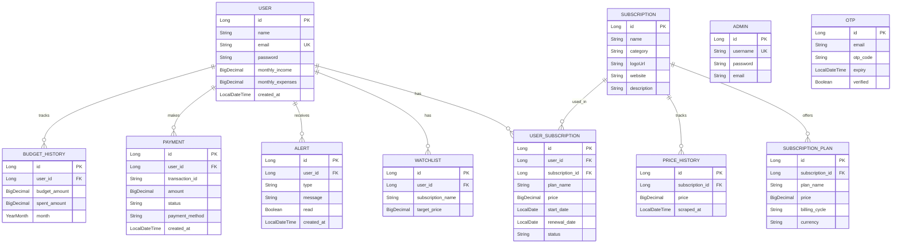

<p align="center">
  
</p>

<h1 align="center">🔔 SubTracker — Subscription Price Tracker</h1>

<p align="center">
  <strong>A full-stack SaaS application to track, compare, and manage all your subscriptions in one place.</strong><br/>
  Built with Spring Boot, React, PostgreSQL, Docker, and Kubernetes.
</p>

<p align="center">
  
  
  
  
  
  
  
  
</p>

---

## 📋 Table of Contents

- [Overview](#-overview)
- [Key Features](#-key-features)
- [Architecture](#-architecture)
- [Tech Stack](#-tech-stack)
- [Project Structure](#-project-structure)
- [Getting Started](#-getting-started)
  - [Prerequisites](#prerequisites)
  - [Local Development Setup](#local-development-setup)
  - [Docker Setup](#docker-setup)
- [Environment Variables](#-environment-variables)
- [API Reference](#-api-reference)
- [Frontend Pages & Routes](#-frontend-pages--routes)
- [Database Schema](#-database-schema)
- [Deployment](#-deployment)
  - [Docker Compose](#docker-compose-production)
  - [Kubernetes](#kubernetes)
  - [Render Cloud](#render-cloud)
  - [CI/CD with Jenkins](#cicd-with-jenkins)
- [Screenshots](#-screenshots)
- [Contributing](#-contributing)
- [Developer](#-developer)

---

## 🌟 Overview

**SubTracker** is a production-grade subscription management platform that helps users track their recurring subscriptions, compare prices across plans, set budgets, receive renewal alerts, and even make payments — all from a beautifully crafted dark-themed dashboard.

The application features **automated web scraping** to keep subscription prices up-to-date for popular services like Netflix, Spotify, JioHotstar, Amazon Prime, YouTube Premium, and more.

---

## 🚀 Key Features

### For Users
| Feature | Description |
|---|---|
| **📊 Dashboard** | Real-time overview of total monthly spend, active subscriptions, upcoming renewals, spending breakdown charts (Recharts) |
| **📝 Subscription Management** | Add, edit, delete, and view detailed info for all your subscriptions |
| **🔍 Price Comparison** | Compare plans side-by-side across services with live-scraped pricing data |
| **💰 Budget Tracking** | Set monthly budget limits, track spending vs budget, and view budget history over time |
| **🔔 Smart Alerts** | Automated notifications for upcoming renewals, price changes, and budget overruns |
| **📌 Watchlist** | Save subscriptions you're interested in and monitor their price changes |
| **📅 Renewal Calendar** | Visual calendar view of all upcoming subscription renewals |
| **💳 Payments** | Integrated payment flow with Stripe Checkout for subscription payments |
| **📄 PDF Export** | Generate and download professional PDF reports of your subscriptions (iText7) |
| **⚙️ Settings** | Update profile info, change password, and manage preferences |
| **❓ Help Center** | In-app help and FAQ section |

### For Admins
| Feature | Description |
|---|---|
| **👥 User Management** | View all registered users and their activity |
| **📈 Admin Dashboard** | Platform-wide analytics — total users, subscriptions, revenue metrics |
| **🕸️ Manual Scraping** | Trigger price scraping on-demand from the admin panel |
| **🔄 Renewal Checks** | Manually trigger renewal alert processing |

### System Capabilities
| Feature | Description |
|---|---|
| **🕷️ Automated Web Scraping** | Scheduled Jsoup-based scraper fetches latest prices from Netflix, Spotify, JioHotstar, Amazon Prime, YouTube Premium, and more |
| **📧 Email Notifications** | Renewal reminders and alerts via Resend HTTP API (fallback from SMTP) |
| **🔐 JWT Authentication** | Secure token-based auth with OTP email verification during signup |
| **🔑 Forgot Password Flow** | OTP-based password reset via email |
| **🛡️ Role-Based Access** | Separate user and admin authentication with protected routes |

---

## 🏗️ Architecture

```
┌─────────────────────────────────────────────────────────┐
│                        Client                           │
│              React 19 + MUI 7 + Vite 7                  │
│            (Dark SaaS Theme / Indigo Accent)            │
│                  Port 3000 (Nginx)                       │
└──────────────────────┬──────────────────────────────────┘
                       │ REST API (JSON)
                       │ JWT Bearer Token
                       ▼
┌─────────────────────────────────────────────────────────┐
│                   API Gateway / Backend                  │
│            Spring Boot 3.2 + Spring Security             │
│                     Port 8084                            │
│                                                          │
│  ┌────────────┐ ┌──────────────┐ ┌───────────────────┐  │
│  │   Auth &   │ │ Subscription │ │  Price Scraper    │  │
│  │   OTP      │ │  Management  │ │  (Jsoup + CRON)   │  │
│  └────────────┘ └──────────────┘ └───────────────────┘  │
│  ┌────────────┐ ┌──────────────┐ ┌───────────────────┐  │
│  │  Payment   │ │   Budget &   │ │  Email Service    │  │
│  │  (Stripe)  │ │   Alerts     │ │  (Resend API)     │  │
│  └────────────┘ └──────────────┘ └───────────────────┘  │
│  ┌────────────┐ ┌──────────────┐                        │
│  │   Admin    │ │  PDF Export  │                        │
│  │  Module    │ │  (iText7)    │                        │
│  └────────────┘ └──────────────┘                        │
└──────────────────────┬──────────────────────────────────┘
                       │ JPA / Hibernate
                       ▼
┌─────────────────────────────────────────────────────────┐
│                    PostgreSQL 16                         │
│               Port 5432 (HikariCP Pool)                 │
└─────────────────────────────────────────────────────────┘
```

---

## 🛠️ Tech Stack

### Backend
| Technology | Version | Purpose |
|---|---|---|
| **Java** | 17 | Core language |
| **Spring Boot** | 3.2.0 | Application framework |
| **Spring Security** | 6.x | Authentication & authorization |
| **Spring Data JPA** | 3.x | Database ORM (Hibernate) |
| **PostgreSQL** | 16 | Primary relational database |
| **HikariCP** | Built-in | Connection pooling |
| **JJWT** | 0.12.3 | JWT token generation & validation |
| **Jsoup** | 1.17.1 | Web scraping for live pricing |
| **iText 7** | 7.2.5 | PDF report generation |
| **Resend API** | HTTP | Email service (OTP, renewals) |
| **Stripe SDK** | API | Payment processing |
| **Lombok** | 1.18.30 | Boilerplate reduction |
| **Maven** | 3.x | Build & dependency management |

### Frontend
| Technology | Version | Purpose |
|---|---|---|
| **React** | 19.2 | UI library |
| **Vite** | 7.2 | Build tool & dev server |
| **MUI (Material UI)** | 7.3 | Component library |
| **MUI Icons** | 7.3 | Icon set |
| **MUI X Date Pickers** | 8.21 | Date selection components |
| **React Router** | 7.10 | Client-side routing |
| **Axios** | 1.13 | HTTP client |
| **Recharts** | 3.5 | Data visualization charts |
| **React Toastify** | 11.0 | Toast notifications |
| **React Calendar** | 6.0 | Calendar component |
| **jsPDF + AutoTable** | 3.0 / 5.0 | Client-side PDF generation |
| **date-fns** | 4.1 | Date utilities |
| **Emotion** | 11.14 | CSS-in-JS (MUI styling engine) |

### DevOps & Infrastructure
| Technology | Purpose |
|---|---|
| **Docker** | Containerization (multi-stage builds) |
| **Docker Compose** | Multi-service orchestration |
| **Kubernetes** | Container orchestration (deployment + service manifests) |
| **Jenkins** | CI/CD pipeline (build → push to Docker Hub) |
| **Nginx** | Frontend static file serving + reverse proxy |
| **Render** | Cloud deployment (render.yaml blueprint) |
| **Vercel** | Alternative frontend deployment (vercel.json) |
| **Docker Hub** | Container registry (`adityaubale08/subtracker-*`) |

---

## 📁 Project Structure

```
Subscription-tracker/
├── 📄 README.md                          # You are here
├── 📄 docker-compose.yml                 # Dev Docker orchestration
├── 📄 docker-compose.prod.yml            # Production overrides
├── 📄 Dockerfile                         # Root multi-service Dockerfile
├── 📄 Dockerfile.db                      # PostgreSQL with init scripts
├── 📄 Jenkinsfile                        # CI/CD pipeline
├── 📄 render.yaml                        # Render cloud blueprint
├── 📄 .env.template                      # Environment variable template
│
├── 📂 subscription-tracker-backend/      # ── SPRING BOOT BACKEND ──
│   ├── 📄 pom.xml                        # Maven dependencies
│   ├── 📄 Dockerfile                     # Backend container
│   ├── 📄 Dockerfile.render              # Render-specific Dockerfile
│   └── 📂 src/main/java/com/subscriptiontracker/
│       ├── 📄 SubscriptionTrackerBackendApplication.java  # Entry point
│       ├── 📂 config/                    # Configuration classes
│       │   ├── SecurityConfig.java       #   Spring Security & CORS rules
│       │   ├── CorsConfig.java           #   CORS origin whitelist
│       │   ├── ScraperConfig.java        #   Scraper timeouts & retry
│       │   └── AsyncConfig.java          #   Async task execution
│       ├── 📂 controller/                # REST API Controllers
│       │   ├── AuthController.java       #   Login, Signup, OTP, Password
│       │   ├── SubscriptionController.java #  Available subscriptions
│       │   ├── UserSubscriptionController.java # User's own subscriptions
│       │   ├── WatchlistController.java  #   Watchlist CRUD
│       │   ├── BudgetController.java     #   Budget management
│       │   ├── AlertController.java      #   Alerts & notifications
│       │   ├── PaymentController.java    #   Payment processing
│       │   ├── StripeController.java     #   Stripe checkout sessions
│       │   ├── PdfController.java        #   PDF export endpoint
│       │   ├── AdminController.java      #   Admin operations
│       │   ├── HealthController.java     #   Health check probe
│       │   └── ScraperTestController.java #  Scraper testing endpoints
│       ├── 📂 entity/                    # JPA Entity Models
│       │   ├── User.java                 #   User accounts
│       │   ├── Admin.java                #   Admin accounts
│       │   ├── Subscription.java         #   Available subscriptions
│       │   ├── SubscriptionPlan.java     #   Plans per subscription
│       │   ├── UserSubscription.java     #   User ↔ Subscription join
│       │   ├── Payment.java              #   Payment transactions
│       │   ├── Alert.java                #   User alerts
│       │   ├── Watchlist.java            #   Watchlist entries
│       │   ├── BudgetHistory.java        #   Budget tracking records
│       │   ├── PriceHistory.java         #   Scraped price history
│       │   └── Otp.java                  #   OTP verification tokens
│       ├── 📂 service/                   # Business Logic Layer
│       │   ├── AuthService.java          #   Authentication logic
│       │   ├── OtpService.java           #   OTP generation & verification
│       │   ├── EmailService.java         #   Email via Resend API
│       │   ├── SubscriptionService.java  #   Subscription catalog
│       │   ├── UserSubscriptionService.java # User subscription mgmt
│       │   ├── PriceScraperService.java  #   Web scraper (109KB!)
│       │   ├── PaymentService.java       #   Payment processing
│       │   ├── StripeService.java        #   Stripe integration
│       │   ├── BudgetService.java        #   Budget calculations
│       │   ├── AlertService.java         #   Alert generation
│       │   ├── WatchlistService.java     #   Watchlist operations
│       │   ├── PdfService.java           #   PDF report builder
│       │   ├── AdminService.java         #   Admin operations
│       │   └── DataInitializerService.java # Seed data on startup
│       ├── 📂 security/                  # Security Layer
│       │   ├── JwtAuthenticationFilter.java # JWT request filter
│       │   ├── JwtUtils.java            #   JWT token utilities
│       │   ├── UserDetailsImpl.java     #   Spring Security user model
│       │   ├── UserDetailsServiceImpl.java # User lookup service
│       │   └── AuthEntryPointJwt.java   #   401 error handler
│       ├── 📂 dto/                      # Data Transfer Objects
│       ├── 📂 exception/               # Custom exceptions
│       ├── 📂 repository/              # Spring Data repositories
│       ├── 📂 scheduler/               # Scheduled Tasks
│       │   └── PriceScrapingScheduler.java # Cron-based price updates
│       └── 📂 util/                    # Utility classes
│
├── 📂 subscription-tracker-frontend/     # ── REACT FRONTEND ──
│   ├── 📄 package.json                   # NPM dependencies
│   ├── 📄 vite.config.js                 # Vite configuration
│   ├── 📄 vercel.json                    # Vercel deploy settings
│   ├── 📄 nginx.conf                     # Nginx config for Docker
│   ├── 📄 Dockerfile                     # Frontend container (Nginx)
│   └── 📂 src/
│       ├── 📄 App.jsx                    # Root — theme, router, layout
│       ├── 📄 main.jsx                   # React entry point
│       ├── 📄 index.css                  # Global styles
│       ├── 📂 components/
│       │   ├── 📂 landing/              # Landing page
│       │   ├── 📂 auth/                 # Login, Signup, Forgot Password
│       │   ├── 📂 dashboard/            # Dashboard, StatsCard, SubscriptionCard
│       │   ├── 📂 subscriptions/        # List, Add, Edit, Details views
│       │   ├── 📂 comparison/           # Price comparison tool
│       │   ├── 📂 budget/               # Budget management
│       │   ├── 📂 alerts/               # Alert notifications
│       │   ├── 📂 watchlist/            # Watchlist page
│       │   ├── 📂 payment/              # Payment, Success, Cancel pages
│       │   ├── 📂 calendar/             # Renewal calendar
│       │   ├── 📂 export/               # PDF export
│       │   ├── 📂 settings/             # User settings
│       │   ├── 📂 help/                 # Help center
│       │   ├── 📂 admin/                # Admin Login & Dashboard
│       │   └── 📂 common/               # Navbar, Sidebar, ProtectedRoute
│       ├── 📂 context/                  # React Context
│       │   └── AuthContext.jsx           # Auth state + JWT management
│       ├── 📂 services/                 # API Layer
│       │   ├── api.js                   # Axios instance + all API calls
│       │   └── ratingsService.js        # Service ratings data
│       ├── 📂 config/                   # App configuration
│       ├── 📂 styles/                   # Component stylesheets
│       └── 📂 utils/                    # Utility functions
│
└── 📂 k8s/                              # ── KUBERNETES MANIFESTS ──
    ├── 📄 deployment.yaml                # Pod deployments (db, backend, frontend)
    ├── 📄 services.yaml                  # K8s service definitions
    └── 📄 README.md                      # K8s setup guide
```

---

## 🚀 Getting Started

### Prerequisites

| Requirement | Version |
|---|---|
| **Java JDK** | 17+ |
| **Node.js** | 18+ |
| **npm** | 9+ |
| **PostgreSQL** | 14+ |
| **Maven** | 3.8+ (or use included `mvnw`) |
| **Docker** *(optional)* | 20+ |
| **Docker Compose** *(optional)* | v2+ |

### Local Development Setup

#### 1. Clone the Repository

```bash
git clone https://github.com/Aditya-Ubale/SubTracker.git
cd SubTracker
```

#### 2. Database Setup

Create a PostgreSQL database:
```sql
CREATE DATABASE subscription_tracker_db;
```

#### 3. Backend Setup

```bash
cd subscription-tracker-backend

# Copy env template and fill in your values
cp .env.template .env

# Build and run with Maven wrapper
./mvnw spring-boot:run
```

The backend starts at **http://localhost:8080** by default.

#### 4. Frontend Setup

```bash
cd subscription-tracker-frontend

# Install dependencies
npm install

# Create local env file
echo "VITE_API_URL=http://localhost:8080/api" > .env.local

# Start dev server
npm run dev
```

The frontend starts at **http://localhost:5173** (Vite dev server).

### Docker Setup

The fastest way to run everything:

```bash
# Copy and configure environment
cp .env.template .env
# Edit .env with your values

# Start all services
docker compose up -d

# View logs
docker compose logs -f

# Stop everything
docker compose down
```

| Service | URL |
|---|---|
| Frontend | http://localhost:3000 |
| Backend API | http://localhost:8084/api |
| PostgreSQL | localhost:5432 |

---

## 🔐 Environment Variables

Copy `.env.template` → `.env` and configure:

| Variable | Description | Default |
|---|---|---|
| **Database** | | |
| `POSTGRES_DB` | Database name | `subscription_tracker_db` |
| `POSTGRES_USER` | DB username | `postgres` |
| `POSTGRES_PASSWORD` | DB password | *(set your own)* |
| `DB_PORT` | DB exposed port | `5432` |
| **Backend** | | |
| `BACKEND_PORT` | API server port | `8084` |
| `JWT_SECRET` | 256-bit signing key | *(generate with `openssl rand -base64 32`)* |
| `JWT_EXPIRATION` | Token TTL (ms) | `86400000` (24 hours) |
| **Email** | | |
| `RESEND_API_KEY` | Resend.com API key | *(get from resend.com)* |
| `MAIL_FROM` | Sender email | `onboarding@resend.dev` |
| **Payments** | | |
| `STRIPE_SECRET_KEY` | Stripe secret key | *(from stripe.com dashboard)* |
| **Frontend** | | |
| `FRONTEND_PORT` | Frontend port | `3000` |
| `FRONTEND_URL` | Frontend base URL | `http://localhost:3000` |
| `VITE_API_URL` | API URL for frontend | `http://localhost:8084/api` |
| **CORS** | | |
| `CORS_ORIGINS` | Allowed origins (comma-separated) | `http://localhost:3000,http://localhost:5173` |
| **Scraper** | | |
| `USD_TO_INR_RATE` | Conversion rate | `83.0` |

---

## 📡 API Reference

Base URL: `/api`

### Authentication
| Method | Endpoint | Description | Auth |
|---|---|---|---|
| `POST` | `/auth/signup` | Register new user (requires OTP) | ❌ |
| `POST` | `/auth/login` | Login with email & password | ❌ |
| `POST` | `/auth/send-otp` | Send OTP to email | ❌ |
| `POST` | `/auth/verify-otp` | Verify email OTP | ❌ |
| `POST` | `/auth/forgot-password` | Send password reset OTP | ❌ |
| `POST` | `/auth/reset-password` | Reset password with OTP | ❌ |
| `GET` | `/auth/me` | Get current user profile | ✅ |
| `PUT` | `/auth/me` | Update profile | ✅ |
| `PUT` | `/auth/change-password` | Change password | ✅ |

### Subscriptions (Catalog)
| Method | Endpoint | Description | Auth |
|---|---|---|---|
| `GET` | `/subscriptions/all` | Get all available subscriptions | ✅ |
| `GET` | `/subscriptions/all/{id}` | Get subscription by ID | ✅ |
| `GET` | `/subscriptions/all/category/{category}` | Filter by category | ✅ |
| `GET` | `/subscriptions/plans/by-name/{name}` | Get plans for a service | ✅ |
| `GET` | `/subscriptions/{id}/plans` | Get plans by subscription ID | ✅ |

### User Subscriptions
| Method | Endpoint | Description | Auth |
|---|---|---|---|
| `GET` | `/user-subscriptions` | Get user's active subscriptions | ✅ |
| `GET` | `/user-subscriptions/{id}` | Get specific user subscription | ✅ |
| `POST` | `/user-subscriptions` | Add a new subscription | ✅ |
| `PUT` | `/user-subscriptions/{id}` | Update a subscription | ✅ |
| `DELETE` | `/user-subscriptions/{id}` | Remove a subscription | ✅ |
| `GET` | `/user-subscriptions/renewals?days=7` | Upcoming renewals | ✅ |
| `GET` | `/user-subscriptions/total` | Monthly spending total | ✅ |

### Watchlist
| Method | Endpoint | Description | Auth |
|---|---|---|---|
| `GET` | `/watchlist` | Get user's watchlist | ✅ |
| `POST` | `/watchlist` | Add to watchlist | ✅ |
| `PUT` | `/watchlist/{id}` | Update watchlist item | ✅ |
| `DELETE` | `/watchlist/{id}` | Remove from watchlist | ✅ |

### Budget
| Method | Endpoint | Description | Auth |
|---|---|---|---|
| `GET` | `/budget` | Get budget summary | ✅ |
| `POST` | `/budget` | Set/update monthly budget | ✅ |
| `GET` | `/budget/history` | Budget history over time | ✅ |

### Alerts
| Method | Endpoint | Description | Auth |
|---|---|---|---|
| `GET` | `/alerts` | Get all alerts | ✅ |
| `GET` | `/alerts/unread` | Get unread alerts | ✅ |
| `GET` | `/alerts/unread/count` | Unread alert count | ✅ |
| `PUT` | `/alerts/{id}/read` | Mark alert as read | ✅ |
| `PUT` | `/alerts/read-all` | Mark all as read | ✅ |
| `DELETE` | `/alerts/{id}` | Delete an alert | ✅ |

### Payments
| Method | Endpoint | Description | Auth |
|---|---|---|---|
| `POST` | `/payments/initiate` | Start a payment | ✅ |
| `POST` | `/payments/process` | Process payment details | ✅ |
| `GET` | `/payments/status/{txnId}` | Check payment status | ✅ |
| `GET` | `/payments/history` | Payment history | ✅ |
| `POST` | `/payments/cancel/{txnId}` | Cancel pending payment | ✅ |
| `POST` | `/payments/add-free` | Add free subscription | ✅ |

### Stripe
| Method | Endpoint | Description | Auth |
|---|---|---|---|
| `POST` | `/stripe/create-checkout-session` | Create Stripe session | ✅ |
| `POST` | `/stripe/verify` | Verify completed payment | ✅ |
| `POST` | `/stripe/cancel` | Handle cancellation | ✅ |

### Export
| Method | Endpoint | Description | Auth |
|---|---|---|---|
| `GET` | `/export/pdf` | Download subscription report PDF | ✅ |

### Admin
| Method | Endpoint | Description | Auth |
|---|---|---|---|
| `POST` | `/admin/login` | Admin login | ❌ |
| `POST` | `/admin/init` | Initialize first admin | ❌ |
| `GET` | `/admin/dashboard` | Admin analytics | 🔑 Admin |
| `GET` | `/admin/users` | List all users | 🔑 Admin |
| `POST` | `/admin/scrape-prices` | Trigger price scraping | 🔑 Admin |
| `POST` | `/admin/check-renewals` | Process renewal alerts | 🔑 Admin |

### Health
| Method | Endpoint | Description | Auth |
|---|---|---|---|
| `GET` | `/health` | Application health check | ❌ |

---

## 🖥️ Frontend Pages & Routes

| Route | Component | Access | Description |
|---|---|---|---|
| `/` | `LandingPage` | Public | Marketing / intro page |
| `/login` | `Login` | Public | User login |
| `/signup` | `Signup` | Public | Registration with OTP |
| `/forgot-password` | `ForgotPassword` | Public | Password reset flow |
| `/dashboard` | `Dashboard` | 🔒 User | Main analytics dashboard |
| `/subscriptions` | `SubscriptionList` | 🔒 User | All subscriptions |
| `/subscriptions/add` | `AddSubscription` | 🔒 User | Add new subscription |
| `/subscriptions/:id` | `SubscriptionDetails` | 🔒 User | Subscription details |
| `/subscriptions/:id/edit` | `EditSubscription` | 🔒 User | Edit subscription |
| `/wishlist` | `Wishlist` | 🔒 User | Saved watchlist |
| `/budget` | `Budget` | 🔒 User | Budget management |
| `/alerts` | `Alerts` | 🔒 User | Notification center |
| `/compare` | `Comparison` | 🔒 User | Plan price comparison |
| `/payment` | `PaymentPage` | 🔒 User | Make a payment |
| `/payment/success` | `PaymentSuccess` | 🔒 User | Payment confirmation |
| `/payment/cancel` | `PaymentCancel` | 🔒 User | Payment cancelled |
| `/settings` | `Settings` | 🔒 User | Account settings |
| `/help` | `Help` | 🔒 User | Help & FAQ |
| `/admin/login` | `AdminLogin` | Public | Admin authentication |
| `/admin/dashboard` | `AdminDashboard` | 🔑 Admin | Admin control panel |

---

## 🗄️ Database Schema



---

## 🚢 Deployment

### Docker Compose (Production)

```bash
docker compose -f docker-compose.yml -f docker-compose.prod.yml up -d
```

Docker images are published to Docker Hub:
- `adityaubale08/subtracker-db:latest`
- `adityaubale08/subtracker-backend:latest`
- `adityaubale08/subtracker-frontend:latest`

### Kubernetes

K8s manifests are provided in the `k8s/` directory:

```bash
kubectl apply -f k8s/deployment.yaml
kubectl apply -f k8s/services.yaml
```

See [`k8s/README.md`](./k8s/README.md) for detailed Kubernetes setup instructions.

### Render Cloud

The project includes a `render.yaml` blueprint for one-click deployment on Render:

1. Fork the repo to your GitHub account
2. Connect Render to your GitHub repo
3. Render auto-detects `render.yaml` and deploys the backend
4. Configure environment variables in the Render dashboard

### CI/CD with Jenkins

The `Jenkinsfile` defines a pipeline that:
1. Checks out code from the `main` branch
2. Builds Docker images
3. Pushes images to Docker Hub (`adityaubale08/subtracker`)

---

## 🎨 Design Philosophy

SubTracker uses a **modern fintech-inspired dark theme** built with MUI's theming system:

- **Color Palette**: Soft dark background (`#0f0f12`) with indigo accent (`#6366f1`)
- **Typography**: Inter font family with tight letter-spacing
- **Components**: Glassmorphic cards, subtle borders (`rgba(255,255,255,0.06)`), smooth transitions
- **Inspiration**: Linear, Vercel, Stripe, Notion
- **Responsiveness**: Fully responsive with collapsible sidebar for mobile

---

## 🤝 Contributing

1. Fork the repository
2. Create a feature branch: `git checkout -b feature/amazing-feature`
3. Commit changes: `git commit -m 'Add amazing feature'`
4. Push to branch: `git push origin feature/amazing-feature`
5. Open a Pull Request

---

## 👨‍💻 Developer

**Aditya Ubale**

- GitHub: [@Aditya-Ubale](https://github.com/Aditya-Ubale)
- Docker Hub: [adityaubale08](https://hub.docker.com/u/adityaubale08)

---

<p align="center">
  <strong>⭐ If you found this useful, give it a star!</strong>
</p>
